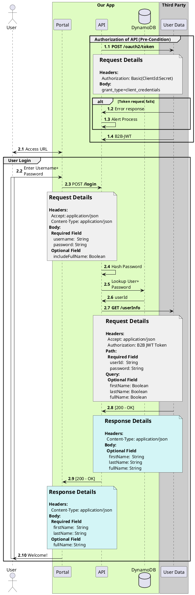

(Check out [PlantUML Introduction](#/programming/uml/introduction) if you're new!

# High Data Density

This is an example of what you can produce when the diagram is the ONLY thing you can give a person/group interested in knowing how things work together.

## "Can" Vs. "Should"

I don't actually recommend this - it's _too much_ in one shot. No one is going to benefit from this much information on one diagram, probably not even you since you'll be maintaining this monster.

The `Request` and `Response` information is great if you're showing ONE API call, but I'd argue it's even BETTER in an [OpenAPI](https://www.openapis.org/) spec and **referenced** by the documentation that accompanies your diagram (I highly recommend utilizing [PlantUML Auto-Numbering](#programming/uml/numbering) to tie docs to diagram).

The **Authorization of API (Pre-Condition)** section could be moved to a separate diagram - it's _probably_ a common flow that any API hitting the external **`Third Party`** service will also need to reference.
