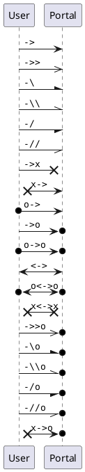
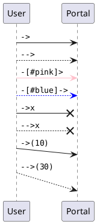

(Check out [PlantUML Introduction](#/programming/uml/introduction) if you're new!

# Arrows & Lines

Before I show this, I want to tell a quick story. I once had a Scrum master, we'll call him [Scott](https://becoming-agile.com/) (Because that's his name), who gave a presentation on Powerpoint.

Yes, even he acknowledged the meta-ness of using Powerpoint to talk about Powerpoint.

Anyway, he was giving a few tips on best practices and how to make the most of the tool, but he was largely explaining what NOT to do. The key take-away I had from his talk was to limit yourself to 1 font, and if you MUST have two fonts, use one [serif](https://en.wikipedia.org/wiki/Serif) and one [sans-serif](https://en.wikipedia.org/wiki/Sans-serif), and use them for separate content/purposes.

## Get To The Point

To that end, I beg of you - do not go overboard on arrows, lines, or other decorations in your diagrams. If differentiating between an asynchronous call and a synchronous call is important, by all means, throw a `-->` in, but... be cognizant of HOW you're using them.

# Ok, the Arrows

# And the Lines

There's actually only two types of lines, but you can get creative with them.

