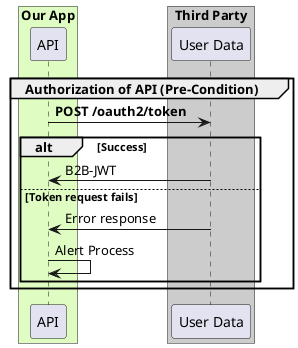
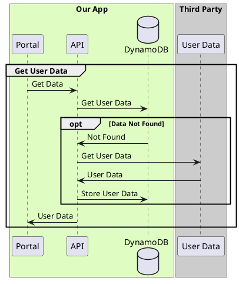
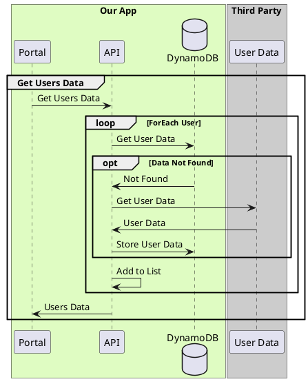
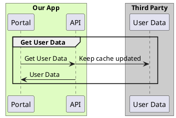

(Check out [PlantUML Introduction](#/programming/uml/introduction) if you're new!

# Groups

If you just want generic groupings, check out [Boxes and Groups](#programming/uml/boxes-and-groups), but if you want _specific_ control blocks, you'll want to look at `alt`, `opt`, `loop` and `par`.

# Alt

An "Alternate" flow - this block can be used to illustrate error paths, alternate conditions, or other non-linear effects of a sequence diagram.

# Opt

An "Optional" flow - similar to `alt`, but intended for extraneous processes more than error conditions.

# Loop

Basically, what it says on the tin - Use this to describe a logic loop.

# Par

When you need to show "Parallel" calls. You'd use the same syntax as the `loop` above, and The diagram doesn't actually change at all.

## Bonus

If you need to show explicit parallel calls, you'll need to invoke the **`teoz`** architecture.

