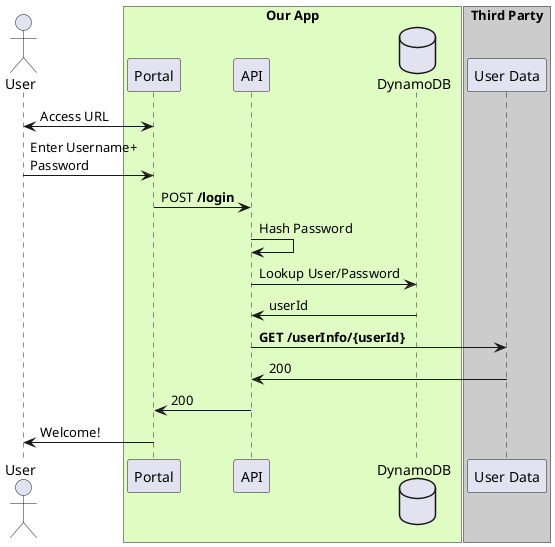
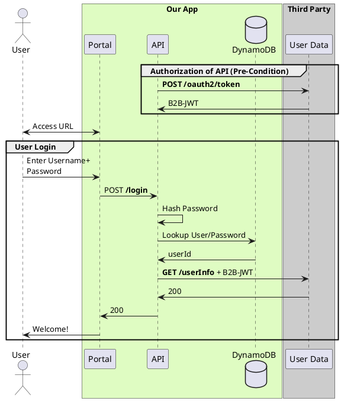
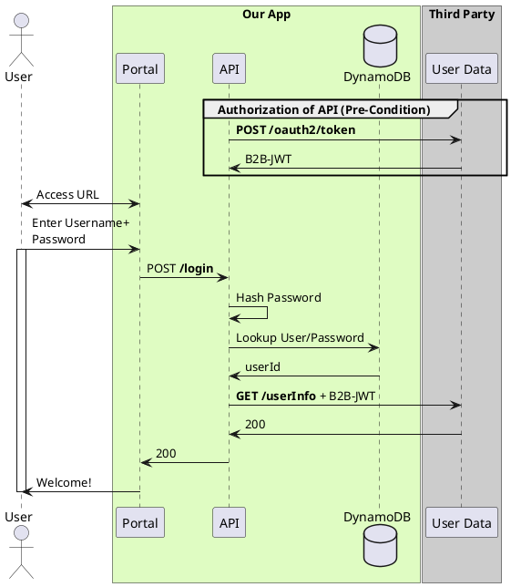

(Check out [PlantUML Introduction](#/programming/uml/introduction) if you're new!

# Ours vs. Theirs

When you need to show calls between systems, and part of the goal is explaining that the systems are somehow _separate_, you can use `box`es:

# This vs. That

If, instead, your diagram needs to communicate multiple logically separate flows, you can also use `group`s:

## Bonus

If you want to show that the **`User`** is waiting while the call is occuring, but don't want the visual noise of the `group`, use the `activate` and `deactivate` commands:

> Note: `activate` and `deactivate` come right AFTER the calls that you want their box to start on

