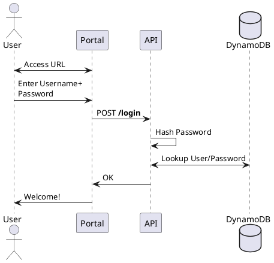

# Nascent Learning

Years ago, I was trying to explain to someone how one server talks to another one, and I wrote something along the lines of:

```flare
ourServer-header+body->theirServer
```

Which, admittedly, wasn't super clear. They asked me for a "Sequence Diagram" instead and in the process of learning about how to make one of those, I stumbled on [WebSequenceDiagrams](https://www.websequencediagrams.com/).

My earlier attempt only needed a little adjustment:

```flare
ourServer->theirServer: header+body
```

And when you fed it into the website's editor, you got:


But, what if you don't want to pay for an account and need larger diagrams? Or if you want to save those files to a Github repository?

# PlantUML + VS Code = Super Power

Do you use [VS Code](https://code.visualstudio.com/)? Go install the [PlantUML](https://marketplace.visualstudio.com/items?itemName=jebbs.plantuml) plug-in right now.

No, I'm not joking, and if you don't use VS Code, install it for this (I use [Vim](https://www.vim.org/) as my daily driver, but I have VS Code for diagrams). Create a new file with the **.puml** extension and paste this in:

**example.puml**


Click the preview button:


And it should render out your diagram IN **VS Code**


As you make adjustments to the code, the diagram updates real-time. If you hover over the diagram, you can also copy it as an image to send it to whomever needs to see it.

> One quick note: the official PlantUML documentation is a veritable swamp of ads, click-bait, and other awfulness. That's one of the reasons I'm offering my own tips & tricks - I understand they need to pay the bills but it's not exactly conducive to hosting content for a presentation.

## Further Reading

- Need to include more detail in your diagram? Check out [PlantUML Notes](#programming/uml/notes-and-formatting)
- Need to delineate between connected systems? Check out [PlantUML Boxes and Groups](#programming/uml/boxes-and-groups)
- Need to provide additional docs along with the diagram? Check out [PlantUML Auto-Numbering](#programming/uml/numbering)
- Need more grouping options? Check out [PlantUML Blocks](#programming/uml/blocks)
- Please use [PlantUML Arrows & Lines](#programming/uml/arrows) sparingly...
