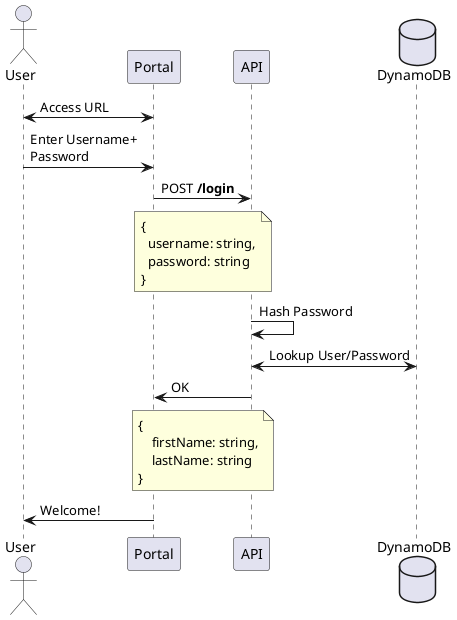
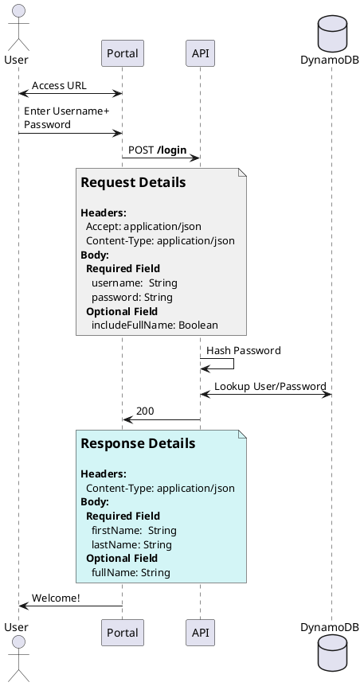

(Check out [PlantUML Introduction](#/programming/uml/introduction) if you're new!

# Noted

Sometimes you want to communicate more than just _which_ systems interact, but also _how_ they interact. For that, I like using notes:

## Kick It Up a Notch

But, what if you want to take your docs to the **_next level_**? Try this out:

Now your documents are descriptive AND delightful to look at.

> For more formatting, check out [Creole markup](https://en.wikipedia.org/wiki/Creole_(markup))
