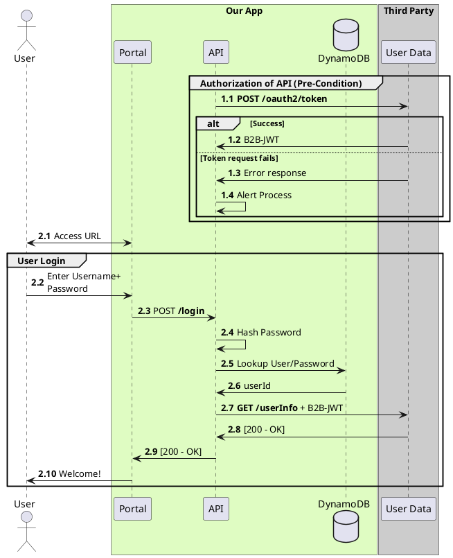

(Check out [PlantUML Introduction](#/programming/uml/introduction) if you're new!

# Auto-Numbering

PlantUML offers an incredibly flexible **`autonumber`** command.

```plantuml
@startuml My Example

autonumber
User -> Portal: Request Page
Portal -> User: HTML page
autonumber stop

User <-> Portal: Request Auth Page

autonumber resume
User -> Portal: Send Username
Portal -> Portal: Think about Username

autonumber 50 10
Portal -> User: Compliment On Name
User -> Portal: Blush

autonumber resume "&lt;font color=red>&lt;b>Call 000"
User -> Portal: Another call
Portal -> User: Some Response

autonumber 1.1.1
User -> Portal: Show Segmented
Portal -> User: Impressive

autonumber inc A
User -> Portal: Bump Major
Portal -> User: What did Major do?

autonumber inc B
User -> Portal: Bump Minor
Portal -> User: Poor kid

note over User,Portal
  You can also use it here %autonumber%
end note

@enduml
```


# Stating the Obvious

This numbering feature is a fantastic way to tie your diagram to your other documentation - they say "A picture is worth a thousand words," but maybe you don't want literally thousands of words in your diagram:




```flare
- Lines 1.1 - 1.4 Illustrate the Pre-authorization that the servers initialize on system start. Our system pulls a username/password from environment variables set during deployment
    * Lines 1.3 and 1.4 Illustrate the failure condition and notification if the authorization fails
- Line 2.2 is the User action that initializes the login
- Line 2.3 Is the **POST /login** call, see [link to docs] for more information
- ...
```

Great for keeping diagrams svelte as well as linking out to other documentation!
